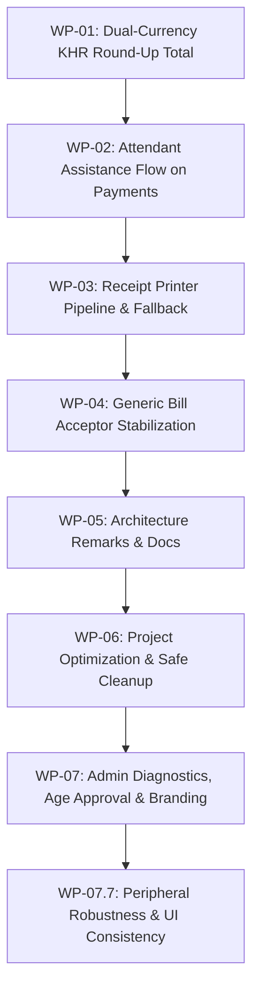

# Self-Checkout Kiosk V2 — Engineering Execution Plan & Task Tracker

> **Document ID:** `ENG-TASK-2026-V2`  
> **Status:** Active Execution Tracker  
> **Scope:** Currency Rounding Rules, UI Attendant Assistance, Receipt Printer Reliability, Bill Acceptor Stabilization & Project Optimization  
> **Companion Documents:** [tracker.md](file:///c:/Users/viti/source/repos/SelfCheckoutKiosk-V2%20-%20Merge/tracker.md) · [Kiosk_Architectural_Blueprint.md](file:///c:/Users/viti/source/repos/SelfCheckoutKiosk-V2%20-%20Merge/src/Kiosk_Architectural_Blueprint.md)

---

## 🧭 Executive Summary & Priority Matrix

| Task ID | Work Package | Priority | Status | Target Area |
| :--- | :--- | :---: | :---: | :--- |
| **WP-01** | [Dual-Currency KHR Round-Up on Total Calculation](#wp-01-dual-currency-khr-round-up-on-total-calculation) | `P0` | 🟢 `COMPLETED` | `DualCurrencyCalculator` & UI Total Conversions |
| **WP-02** | [Attendant Assistance Flow Across All Payment Screens](#wp-02-attendant-assistance-flow-across-all-payment-screens) | `P1` | 🟢 `COMPLETED` | Cash, QR, and Payment Option UI screens |
| **WP-03** | [Receipt Printer Pipeline & Error Recovery](#wp-03-receipt-printer-pipeline--error-recovery) | `P0` | 🟢 `COMPLETED` | ESC/POS direct stream, USB/COM fallback |
| **WP-04** | [Generic Bill Acceptor & ITL Hardware Stabilization](#wp-04-generic-bill-acceptor--itl-hardware-stabilization) | `P0` | 🟡 `IN PROGRESS` | ITL NV200/NV11, simulator & validator |
| **WP-05** | [Architecture Interaction Flow & Component Remarks](#wp-05-architecture-interaction-flow--component-remarks) | `P1` | 🔴 `TODO` | In-depth code remarks & lifecycle mapping |
| **WP-06** | [Project Structure Optimization & Dead Code Removal](#wp-06-project-structure-optimization--dead-code-removal) | `P1` | 🟢 `COMPLETED` | Safe cleanup, unused tools & structure pruning |
| **WP-07** | [Admin Diagnostics & Age-Restricted Approval Workflow](#wp-07-admin-diagnostics--age-restricted-approval-workflow) | `P0` | 🟢 `COMPLETED` | Vault breakdown, receipt reprint, age approval modal, store branding & persistence |

---

## 🛠️ Detailed Work Packages

---

### WP-01: Dual-Currency KHR Round-Up on Total Calculation
**Objective:** When converting item totals or basket subtotals into KHR, enforce the Cambodian retail rounding rule: any fractional amount between 1 and 99 KHR (e.g. 50 KHR) must **always round UP to the nearest 100 KHR**, while change dispensing continues to round **DOWN** to prevent dispensing unheld currency.

- [x] **1.1 Rounding Rule Implementation in `DualCurrencyCalculator`:**
  - Implemented `CalculateTotalKhr(decimal totalUsd, decimal exchangeRate)` and `RoundUpToNearest100Khr(decimal rawKhr)`.
    $$\text{Total KHR} = \lceil (\text{totalUsd} \times \text{exchangeRate}) / 100 \rceil \times 100$$
  - Example: $\$1.01 \times 4100 = 4141\text{ KHR} \rightarrow 4200\text{ KHR}$ (41 KHR remainder rounds UP to 100).
- [x] **1.2 UI & Receipt Synchronization:**
  - `CartViewModel`, `CartService`, `QRPaymentViewModel`, `IngestionProgressViewModel`, and `EpsonReceiptPrinter` now use `CalculateTotalKhr`.
- [x] **1.3 Unit Tests:**
  - Added test cases in `DualCurrencyCalculatorTests.cs` (Exact, 1 KHR, 50 KHR, 99 KHR remainders, Invalid rate). All 97 tests passing.

---

### WP-02: Attendant Assistance Flow Across All Payment Screens
**Objective:** Provide a prominent, accessible "Help / Call Attendant" button on all customer payment screens (`PaymentSelectionView`, `QRPaymentView`, `IngestionProgressView`), enabling customers to summon support without cancelling their transaction.

- [x] **2.1 Presentation State & UI Triggers:**
  - Added accessible `HelpButton` controls across `PaymentSelectionView.xaml`, `QRPaymentView.xaml`, and `IngestionProgressView.xaml`.
- [x] **2.2 Localized Assistance Dialogs:**
  - Integrated localized `HelpIsOnTheWay` and `HelpMessage` modal dialogs supporting English and Khmer languages.
- [x] **2.3 Safe Flow Continuation:**
  - Customers can dismiss the assistance dialog and proceed with their checkout without resetting their active transaction or losing scanned items.

---

### WP-03: Receipt Printer Pipeline & Multi-Vendor Discovery
**Objective:** Ensure rock-solid thermal printing on Epson EU-m30 / TM-m30 (and compatible ESC/POS printers) with native Win32 RAW Spooler delivery, multi-vendor auto-discovery, real-time USB plug/unplug hardware detection, out-of-paper detection, and honest status reporting.

- [x] **3.1 Native Win32 Spooler RAW Mode (`WinSpoolRawPrinter.cs`):**
  - Uses direct Win32 `winspool.drv` P/Invoke (`OpenPrinter`, `StartDocPrinter`, `StartPagePrinter`, `WritePrinter`, `EndPagePrinter`, `EndDocPrinter`, `ClosePrinter`).
  - Bypasses Windows GDI rasterization and sends pure binary ESC/POS command streams directly to the targeted POS printer.
  - **Never touches or conflicts with the laptop's default printer** (e.g. `EPSON L6490` or `Microsoft Print to PDF`).
- [x] **3.2 Multi-Vendor POS Printer Auto-Discovery (`PrinterDiscovery.cs`):**
  - Automatically enumerates installed system printers and prioritizes thermal/receipt printers (Epson `EU-m30`, `TM-m30`, `TM-T88`, `TM-T20`, `Generic / Text Only`, Star Micronics, Citizen, Bixolon, Xprinter, Rongta, POS-58, POS-80, Zebra).
  - Explicitly filters out virtual and office printers (`Microsoft Print to PDF`, `OneNote`, `Fax`, `XPS Document Writer`).
  - Supports environment and config overrides (`SELFCHECKOUTKIOSK_PRINTER_NAME`, `SELFCHECKOUTKIOSK_PRINTER_PORT`, `kiosk-test.json`).
- [x] **3.3 Real-Time PnP Hardware Plug/Unplug Detection:**
  - Integrated `cfgmgr32.dll` (`CM_Locate_DevNode` & `CM_Get_DevNode_Status`) and Win32 Spooler status queries in `WinSpoolRawPrinter.QueryPrinterStatus`.
  - Instantly detects if the physical USB cable is unplugged or powered off (`"USB Cable Unplugged / Disconnected"`).
  - Integrated into the 2-second background loop in `App.xaml.cs` (`StartContinuousHardwareMonitor`), updating `HardwareStatusManager` and Admin Diagnostics dynamically.
- [x] **3.4 Live Admin Diagnostics & Reprint Execution:**
  - `AdminDiagnosticsViewModel` displays the true detected device name (e.g. `EPSON EU-m30`), port (`USB001`), and real-time connection badge (Green/Red).
  - "Reprint Last Receipt" checks device availability and gives instant status feedback.
- [x] **3.5 Format & Currency Synchronization:**
  - Synchronized receipt formatting with the KHR round-up rule on totals and verified dual-currency layout.
- [x] **3.6 Supermarket Receipt Template & 80mm Paper Alignment (79.5mm / 48 Cols):**
  - Formats content across 48 columns (576 dots @ 203 DPI / 72.0mm printable width) matching standard $79.5 \pm 0.5\text{ mm}$ ($3.13" \pm 0.02"$) thermal paper with balanced 3.75mm physical hardware margins.
  - Dynamically itemizes basket products (SKU, Qty, Unit Price, Line Total) captured from `CartItemSnapshot` in `Payment.cs`.
  - Completely removed tax and `CHANGE DUE` (shows only `TOTAL DUE` in USD & KHR, and `PAID ([METHOD])`).
  - Injected `FS .` (`0x1C, 0x2E`) Kanji cancel command, `ESC t 0` (PC437 ASCII), and strict ASCII sanitization to permanently eliminate accidental Chinese/Asian character output.

---

### WP-04: Generic Bill Acceptor & ITL Hardware Stabilization
**Objective:** Ensure ITL NV200/NV11, generic SSP/cctalk bill validator connection, escrow polling, stack, reject, and process auto-start in `CashApiProcessManager` work reliably.

- [x] **4.1 Cash API Background Execution & Debug Toggle:**
  - `CashApiProcessManager` runs the Cash API / Simulator process seamlessly in the **background** (`CreateNoWindow = true`, `UseShellExecute = false`, `WindowStyle = ProcessWindowStyle.Hidden`) on kiosk startup (F5) and during auto-reconnect retry loops without popup console windows.
  - Added debug toggle: Developers can switch `CashApiProcessManager.RunInBackground = false` in code or set environment variable `SELFCHECKOUTKIOSK_SHOW_CASH_API_WINDOW=1` / `true` to bring up the visible console window for debugging whenever needed.
- [x] **4.2 Escrow & Stack Protocol Handshake:**
  - Verified and finalized escrow lifecycle in `LLCoreLogicEngine.cs` + `HardwareAppendLog.cs` + `ItlRestCashRecycler.cs` + `VendorXCashRecycler.cs`.
  - Normal cash acceptance: Note is accepted, stacked to vault, and change is dispensed via `DualCurrencyCalculator`.
  - Exact-cash-only lockout: Note exceeding balance is immediately rejected and returned to customer; notes never remain stuck in escrow.
- [ ] **4.3 Serial COM Auto-Discovery & Health Probing:**
  - Stabilize prioritized COM port discovery for ITL validator hardware.
- [ ] **4.4 Generic Protocol Adapter Interface:**
  - Ensure `ICashRecycler` contract cleanly abstracts both REST-bridge and direct serial SSP/cctalk bill acceptors without leaking vendor-specific abstractions into Core.

---

### WP-05: Architecture Interaction Flow & Component Remarks
**Objective:** Add comprehensive function-level remarks, docstrings, and an interaction flow diagram illustrating how Core Brain, HAL Adapters, Persistence, Audit Log, and Presentation ViewModels interact during each checkout phase.

- [ ] **5.1 End-to-End Interaction Lifecycle Remarks:**
  - Document Scan Phase → Payment Selection → Cash Ingestion & Audit → Change Dispensing → Receipt & Cloud Sync.
- [ ] **5.2 In-Code Remarks:**
  - Add standard XML doc comments (`
`, `<remarks>`, `<param>`) on all core interfaces and public API methods documenting cross-cutting dependencies.

---

### WP-06: Project Structure Optimization & Dead Code Removal
**Objective:** Streamline the solution structure, eliminate orphaned tools/files safely without touching `.presentation` or breaking UI flows.

- [x] **6.1 Prune Orphaned Tools & Redundancies:**
  - Removed deprecated orphaned `KeyGen` tool directory (`tools/KeyGen`) superseded by `DevLicenseTokenGenerator`.
  - Preserved active models and headless test harness in `SelfCheckoutKiosk.Presentation` untouched.
- [x] **6.2 Solution & Reference Synchronization:**
  - Synchronized solution references and documentation in `tracker.md` and `ENGINEERING_TASKS.md`.
  - Verified all projects and test suites build and execute without regression.

---

### WP-07: Standalone Production Packaging & Distribution
**Objective:** Provide a complete, self-contained Windows x64 release package with standalone executables for the Kiosk App, Cash Device REST API, and offline License Generator.

- [x] **7.1 Self-Contained WinUI 3 Kiosk Application (`dist/SelfCheckoutKiosk-Package/KioskApp`):**
  - Fully self-contained `SelfCheckoutKiosk.App.exe` built specifically for `win-x64` with bundled runtime, SQLCipher, DWriteCore, ONNX runtime, and all native libraries.
  - Complete asset bundling: all i18n JSON localizations (`en.json`, `km.json`), flag PNGs, logo assets, videos, and fonts.
  - Hardened absolute path loading in `MainWindow.xaml.cs` and `MediaBrandingService` (`Path.Combine(AppContext.BaseDirectory, ...)`).
- [x] **7.2 Standalone Cash Device REST API Daemon (`dist/SelfCheckoutKiosk-Package/CashDeviceSimulator-API`):**
  - Single-file standalone `CashDeviceSimulator.exe` with smart port fallback: binds to port 5000, or automatically falls back to port 5055 if port 5000 is occupied by a live hardware bridge (`CashDevice-RestAPI.exe`).
  - Added package path resolution in `CashApiProcessManager.cs` to locate neighboring simulator/SDK executables automatically.
- [x] **7.3 Standalone Offline License Generator (`dist/SelfCheckoutKiosk-Package/LicenseGenerator`):**
  - Single-file `GenerateLicense.exe` with interactive prompt and automatic node-locked deployment to `KioskApp\license.token`.
- [x] **7.4 1-Click Launchers & Deployment Documentation:**
  - Added `Start-Kiosk-With-API.bat`, `Start-Kiosk.bat`, `Start-CashDevice-API.bat`, `Generate-License-For-This-Device.bat`, and `README_DEPLOYMENT.md`.
  - Added working directory context pinning (`cd /d "%~dp0KioskApp"`) so launchers work from any directory or administrative context.

---

### WP-08: Admin Diagnostics & Age-Restricted Approval Workflow
**Objective:** Provide full attendant diagnostics UI matching target designs (Image 1, 2, 3), real-time vault breakdown tracking and reset confirmation, thermal receipt reprinting, genuine external hardware connectivity status, and a global staff assistance / age-restricted item approval pipeline.

- [x] **8.1 Dynamic Vault Breakdown & Reset Confirmation:**
  - Implemented `VaultInventoryService` tracking deposited notes across KHR (100, 500, 1000, 5000, 10000, 20000, 50000) and USD ($1, $5, $10, $20, $50, $100).
  - Wired into `PaymentService.TrySubmitCash` and `HandlePhysicalEscrowResolved`.
  - Added "Reset Vault Breakdown" button in `AdminDiagnosticsView.xaml` triggering a WinUI `ContentDialog` confirmation before resetting counts.
- [x] **8.2 Store & Reprint Last Receipt:**
  - Updated `ReceiptPrinterService` to preserve `_lastPayment`.
  - Wired "Reprint Last Receipt" button to reprint the cached transaction marked as `[DUPLICATE / REPRINT]`.
- [x] **8.3 Genuine External Hardware Status:**
  - `HardwareStatusManager` and `AdminDiagnosticsViewModel` strictly report genuine external serial / USB port availability for scanner and printer, showing red/green status indicators.
- [x] **8.4 Age-Restricted Customer Alert & Admin Approval:**
  - Created `AgeRestrictedApprovalManager` to manage pending approvals across customer and admin views.
  - In `CartView.xaml.cs` and `App.xaml.cs`, scanning age-restricted products triggers the modal dialog ("One moment — staff assistance needed" / "សូមរង់ចាំមួយភ្លែត — ត្រូវការជំនួយពីបុគ្គលិក") with blue circular badge, Admin shortcut, and full Khmer (`km`) / English (`en`) dictionary localization and font switching.
  - In `AdminDiagnosticsView.xaml`, renders the top approval card (bold product name, gray SKU, vibrant blue `[Approve]` button, outlined red `[Reject]` button with full hover/pressed states) matching reference design.
  - **Quantity Stacking Fix:** `AgeRestrictedApprovalManager.Approve()` directly invokes `App.CartServiceInstance.AddItem(...)` exactly once upon attendant approval. Removed leaky view-level event subscriptions in `CartView` that caused duplicate/multiplied quantities when scanning and approving subsequent items.
  - Approved items are immediately added to the cart, pre-existing cart items are preserved intact, and repeated scans increment by exactly +1 per approved scan.
- [x] **8.5 Admin Diagnostics Design & Navigation:**
  - Restored `AdminDiagnosticsView.xaml` to match `MediaBrandingView.xaml` design language (`#F1F5F9` background, white top bar, `CornerRadius="12"` cards with `#CBD5E1` borders, responsive 2-column ↔ portrait layout, section header style).
  - Preserved original header: "Admin Diagnostics" bold title, `System Operational` green pill badge, subtitle, text-only `Close` button.
  - Retained prominent "Media & Branding Management" card with blue icon badge and `Open` accent button.
  - Reset Vault Counts button uses red danger styling (`#FEF2F2` background, `#FECACA` border, `#DC2626` text) with dedicated hover/pressed visual states and a destructive `ContentDialog` confirmation.
  - Implemented `INavigationService.NavigateBackToCustomer()` which prunes admin stack entries and returns to whichever customer screen opened Admin.
- [x] **8.6 Dynamic Store Branding & Cross-Session Persistence:**
  - Updated `BrandingConfig` model to track `CompanyName`, `Tagline`, `LogoFileName` (with fallback to `ca.ico`), `StoreHours`, and `KioskId`.
  - Added JSON serialization & local disk persistence (`branding_config.json`) in `MediaBrandingService`, automatically loading saved branding and playlist on application boot.
  - Wired `MediaBrandingService.BrandingChanged` event to notify listeners dynamically.
  - Updated `HomeViewModel` and `HomeView.xaml` to dynamically render the store logo, brand name, tagline, and store hours in the header and footer across both 16:9 Landscape and 9:16 Portrait kiosk aspect ratios.
  - Enhanced `MediaBrandingView.xaml` with live logo image preview, store hours configuration, and save action.
- [x] **7.7 Peripheral Robustness & UI Consistency Fixes:**
  - **Scanner Binary Noise Filtering:** Added strict validation in `DatalogicBarcodeScanner.IsValidBarcodeString` and `CartView.ProcessScannedBarcodeAsync` to filter out non-barcode binary serial traffic (e.g. bluetooth frames / heartbeat pulses), eliminating spurious "Item Not Found" dialogs with corrupted characters.
  - **Payment Decoupling:** Added `isCash` parameter to `IPaymentService.BeginTransaction(...)` and configured `QRPaymentViewModel` with `isCash: false`. Cash hardware arming (`ArmAcceptanceAsync`) is now strictly constrained to cash transactions with verified online hardware, preventing spurious exceptions during KHQR flows.
  - **Universal Help Button Consistency:** Unified Help button icon across all customer views (`HomeView`, `CartView`, `PaymentSelectionView`, `IngestionProgressView`, `QRPaymentView`) to Segoe Fluent glyph `&#xE9CE;` and aligned the header pill chip in `PaymentSelectionView`.

---

## 📈 Execution Sequence

