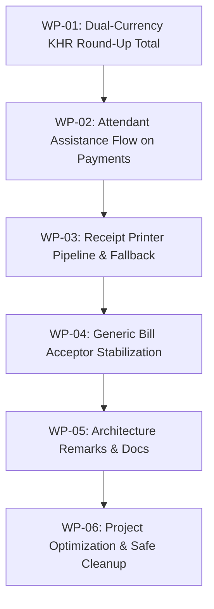

# Self-Checkout Kiosk V2 — Engineering Execution Plan & Task Tracker

> **Document ID:** `ENG-TASK-2026-V2`  
> **Status:** Active Execution Tracker  
> **Scope:** Currency Rounding Rules, UI Attendant Assistance, Receipt Printer Reliability, Bill Acceptor Stabilization & Project Optimization  
> **Companion Documents:** [tracker.md](file:///c:/Users/viti/source/repos/SelfCheckoutKiosk-V2%20-%20Merge/tracker.md) · [Kiosk_Architectural_Blueprint.md](file:///c:/Users/viti/source/repos/SelfCheckoutKiosk-V2%20-%20Merge/src/Kiosk_Architectural_Blueprint.md)

---

## 🧭 Executive Summary & Priority Matrix

| Task ID | Work Package | Priority | Status | Target Area |
| :--- | :--- | :---: | :---: | :--- |
| **WP-01** | [Dual-Currency KHR Round-Up on Total Calculation](#wp-01-dual-currency-khr-round-up-on-total-calculation) | `P0` | 🟢 `COMPLETED` | `DualCurrencyCalculator` & UI Total Conversions |
| **WP-02** | [Attendant Assistance Flow Across All Payment Screens](#wp-02-attendant-assistance-flow-across-all-payment-screens) | `P1` | 🟢 `COMPLETED` | Cash, QR, and Payment Option UI screens |
| **WP-03** | [Receipt Printer Pipeline & Error Recovery](#wp-03-receipt-printer-pipeline--error-recovery) | `P0` | 🟢 `COMPLETED` | ESC/POS direct stream, USB/COM fallback |
| **WP-04** | [Generic Bill Acceptor & ITL Hardware Stabilization](#wp-04-generic-bill-acceptor--itl-hardware-stabilization) | `P0` | 🟡 `IN PROGRESS` | ITL NV200/NV11, simulator & validator |
| **WP-05** | [Architecture Interaction Flow & Component Remarks](#wp-05-architecture-interaction-flow--component-remarks) | `P1` | 🔴 `TODO` | In-depth code remarks & lifecycle mapping |
| **WP-06** | [Project Structure Optimization & Dead Code Removal](#wp-06-project-structure-optimization--dead-code-removal) | `P1` | 🟢 `COMPLETED` | Safe cleanup, unused tools & structure pruning |
| **WP-07** | [Admin Diagnostics & Age-Restricted Approval Workflow](#wp-07-admin-diagnostics--age-restricted-approval-workflow) | `P0` | 🟢 `COMPLETED` | Dynamic vault breakdown, reset dialog, receipt reprint, staff approval modal |

---

## 🛠️ Detailed Work Packages

---

### WP-01: Dual-Currency KHR Round-Up on Total Calculation
**Objective:** When converting item totals or basket subtotals into KHR, enforce the Cambodian retail rounding rule: any fractional amount between 1 and 99 KHR (e.g. 50 KHR) must **always round UP to the nearest 100 KHR**, while change dispensing continues to round **DOWN** to prevent dispensing unheld currency.

- [x] **1.1 Rounding Rule Implementation in `DualCurrencyCalculator`:**
  - Implemented `CalculateTotalKhr(decimal totalUsd, decimal exchangeRate)` and `RoundUpToNearest100Khr(decimal rawKhr)`.
    $$\text{Total KHR} = \lceil (\text{totalUsd} \times \text{exchangeRate}) / 100 \rceil \times 100$$
  - Example: $\$1.01 \times 4100 = 4141\text{ KHR} \rightarrow 4200\text{ KHR}$ (41 KHR remainder rounds UP to 100).
- [x] **1.2 UI & Receipt Synchronization:**
  - `CartViewModel`, `CartService`, `QRPaymentViewModel`, `IngestionProgressViewModel`, and `EpsonReceiptPrinter` now use `CalculateTotalKhr`.
- [x] **1.3 Unit Tests:**
  - Added test cases in `DualCurrencyCalculatorTests.cs` (Exact, 1 KHR, 50 KHR, 99 KHR remainders, Invalid rate). All 97 tests passing.

---

### WP-02: Attendant Assistance Flow Across All Payment Screens
**Objective:** Provide a prominent, accessible "Help / Call Attendant" button on all customer payment screens (`PaymentSelectionView`, `QRPaymentView`, `IngestionProgressView`), enabling customers to summon support without cancelling their transaction.

- [x] **2.1 Presentation State & UI Triggers:**
  - Added accessible `HelpButton` controls across `PaymentSelectionView.xaml`, `QRPaymentView.xaml`, and `IngestionProgressView.xaml`.
- [x] **2.2 Localized Assistance Dialogs:**
  - Integrated localized `HelpIsOnTheWay` and `HelpMessage` modal dialogs supporting English and Khmer languages.
- [x] **2.3 Safe Flow Continuation:**
  - Customers can dismiss the assistance dialog and proceed with their checkout without resetting their active transaction or losing scanned items.

---

### WP-03: Receipt Printer Pipeline & Error Recovery
**Objective:** Ensure rock-solid thermal printing on Epson TM-m30 (and compatible ESC/POS printers) with proper port fallback, out-of-paper detection, and print status reporting.

- [x] **3.1 ESC/POS Stream Robustness:**
  - Robust direct port stream handling with exception guard; missing or denied ports gracefully fallback to text audit spooling without throwing unhandled exceptions to UI threads.
- [x] **3.2 Paper & Device Status Feedback:**
  - Status probes in `IsPaperPresentAsync` and `ConnectAsync` report device availability accurately.
- [x] **3.3 Format Optimization:**
  - Synchronized receipt formatting with the KHR round-up rule on totals and verified dual-currency layout.

---

### WP-04: Generic Bill Acceptor & ITL Hardware Stabilization
**Objective:** Ensure ITL NV200/NV11, generic SSP/cctalk bill validator connection, escrow polling, stack, reject, and process auto-start in `CashApiProcessManager` work reliably.

- [x] **4.1 Cash API Background Execution & Debug Toggle:**
  - `CashApiProcessManager` runs the Cash API / Simulator process seamlessly in the **background** (`CreateNoWindow = true`, `UseShellExecute = false`, `WindowStyle = ProcessWindowStyle.Hidden`) on kiosk startup (F5) and during auto-reconnect retry loops without popup console windows.
  - Added debug toggle: Developers can switch `CashApiProcessManager.RunInBackground = false` in code or set environment variable `SELFCHECKOUTKIOSK_SHOW_CASH_API_WINDOW=1` / `true` to bring up the visible console window for debugging whenever needed.
- [ ] **4.2 Escrow & Stack Protocol Handshake:**
  - Finalize software escrow polling against REST endpoints and ensure auto-stacking on transaction completion.
- [ ] **4.3 Serial COM Auto-Discovery & Health Probing:**
  - Stabilize prioritized COM port discovery for ITL validator hardware.
- [ ] **4.3 Generic Protocol Adapter Interface:**
  - Ensure `ICashRecycler` contract cleanly abstracts both REST-bridge and direct serial SSP/cctalk bill acceptors without leaking vendor-specific abstractions into Core.

---

### WP-05: Architecture Interaction Flow & Component Remarks
**Objective:** Add comprehensive function-level remarks, docstrings, and an interaction flow diagram illustrating how Core Brain, HAL Adapters, Persistence, Audit Log, and Presentation ViewModels interact during each checkout phase.

- [ ] **5.1 End-to-End Interaction Lifecycle Remarks:**
  - Document Scan Phase → Payment Selection → Cash Ingestion & Audit → Change Dispensing → Receipt & Cloud Sync.
- [ ] **5.2 In-Code Remarks:**
  - Add standard XML doc comments (`
`, `<remarks>`, `<param>`) on all core interfaces and public API methods documenting cross-cutting dependencies.

---

### WP-06: Project Structure Optimization & Dead Code Removal
**Objective:** Streamline the solution structure, eliminate orphaned tools/files safely without touching `.presentation` or breaking UI flows.

- [x] **6.1 Prune Orphaned Tools & Redundancies:**
  - Removed deprecated orphaned `KeyGen` tool directory (`tools/KeyGen`) superseded by `DevLicenseTokenGenerator`.
  - Preserved active models and headless test harness in `SelfCheckoutKiosk.Presentation` untouched.
- [x] **6.2 Solution & Reference Synchronization:**
  - Synchronized solution references and documentation in `tracker.md` and `ENGINEERING_TASKS.md`.
  - Verified all projects and test suites build and execute without regression.

---

### WP-07: Admin Diagnostics & Age-Restricted Approval Workflow
**Objective:** Provide full attendant diagnostics UI matching target designs (Image 1, 2, 3), real-time vault breakdown tracking and reset confirmation, thermal receipt reprinting, genuine external hardware connectivity status, and a global staff assistance / age-restricted item approval pipeline.

- [x] **7.1 Dynamic Vault Breakdown & Reset Confirmation:**
  - Implemented `VaultInventoryService` tracking deposited notes across KHR (100, 500, 1000, 5000, 10000, 20000, 50000) and USD ($1, $5, $10, $20, $50, $100).
  - Wired into `PaymentService.TrySubmitCash` and `HandlePhysicalEscrowResolved`.
  - Added "Reset Vault Breakdown" button in `AdminDiagnosticsView.xaml` triggering a WinUI `ContentDialog` confirmation before resetting counts.
- [x] **7.2 Store & Reprint Last Receipt:**
  - Updated `ReceiptPrinterService` to preserve `_lastPayment`.
  - Wired "Reprint Last Receipt" button to reprint the cached transaction marked as `[DUPLICATE / REPRINT]`.
- [x] **7.3 Genuine External Hardware Status:**
  - `HardwareStatusManager` and `AdminDiagnosticsViewModel` strictly report genuine external serial / USB port availability for scanner and printer, showing red/green status indicators.
- [x] **7.4 Age-Restricted Customer Alert & Admin Approval:**
  - Created `AgeRestrictedApprovalManager` to manage pending approvals across customer and admin views.
  - In `CartView.xaml.cs`, scanning age-restricted products triggers the modal dialog ("One moment — staff assistance needed") with blue circular badge and Admin shortcut.
  - In `AdminDiagnosticsView.xaml`, renders the top approval card (bold product name, gray SKU, vibrant blue `[Approve]` button, outlined red `[Reject]` button with full hover/pressed states) matching reference design.
  - **Bugfix:** `OnProductApproved` event subscribed permanently in the `CartView` constructor (not in `Loaded`/`Unloaded`) so the cart-add handler fires even when `CartView` is off-screen during admin navigation. This was the root cause of approved items not being added to cart.
  - Approved items are immediately added to `CartViewModel.Items` via `DispatcherQueue.TryEnqueue`; all pre-existing cart items are preserved intact.
- [x] **7.5 Admin Diagnostics Design & Navigation:**
  - Restored `AdminDiagnosticsView.xaml` to match `MediaBrandingView.xaml` design language (`#F1F5F9` background, white top bar, `CornerRadius="12"` cards with `#CBD5E1` borders, responsive 2-column ↔ portrait layout, section header style).
  - Preserved original header: "Admin Diagnostics" bold title, `System Operational` green pill badge, subtitle, text-only `Close` button.
  - Retained prominent "Media & Branding Management" card with blue icon badge and `Open` accent button.
  - Reset Vault Counts button uses red danger styling (`#FEF2F2` background, `#FECACA` border, `#DC2626` text) with dedicated hover/pressed visual states and a destructive `ContentDialog` confirmation.
  - Implemented `INavigationService.NavigateBackToCustomer()` which prunes admin stack entries and returns to whichever customer screen opened Admin.

---

## 📈 Execution Sequence

